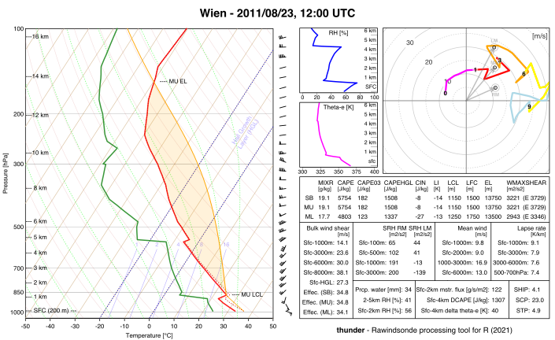

thunder - R Package to compute convective indices from rawindsonde data
====================

<!-- badges: start -->
[](https://github.com/bczernecki/thunder/actions)
[](https://codecov.io/gh/bczernecki/thunder?branch=devel)
<!-- badges: end -->
To be changed when CRAN comes...
[](https://cran.r-project.org/package=climate)
[](https://cran.r-project.org/package=climate)

`thunder` is a freeware R package for performing analyses of servere weather-related atmospheric convective indices based on rawin sonde profiles.

The main core of the algorithm used is a highly optimized version of C++ code dedicated for calculating sounding derived indices related with atmospheric convections.

## Installation
------------

The stable version can be installed from the CRAN repository:

``` r
install.packages("thunder")
```


The development version can be installed directly from the github repository:

``` r
library(remotes);install_github("bczernecki/thunder")
```

## Usage
-----

### Draw Skew-T diagram, hodograph and most important indices on a single layout and save it to png file

``` r
data("sounding_wien") # take example dataset:
pressure = sounding_wien$PRES
altitude = sounding_wien$HGHT
temp = sounding_wien$TEMP
dpt = sounding_wien$DWPT
wd = sounding_wien$DRCT
ws = sounding_wien$SKNT
sounding_save(filename = "myfile.png", title = "Vienna (2011/08/23, 1200 UTC)", pressure, altitude, temp, dpt, wd, ws)
```




### Compute all convective indices based on a random radiosonde data:

``` r
library("thunder")
pressure <- c(1000, 855, 700, 500, 300, 100, 10) # pressure
altitude <- c(0, 1500, 2500, 6000, 8500, 12000, 25000) # altitude
temp <- c(25, 10, 0, -15, -30, -50, -92) # air temperature
dpt <- c(20, 5, -5, -30, -55, -80, -99) # dew point temperature
wd <- c(0, 90, 135, 180, 270, 350, 0) # wind direction
ws <- c(5, 10, 20, 30, 40, 5, 0) # wind speed
options(digits = 2) # change output formatting precision
sounding_compute(pressure, altitude, temp, dpt, wd, ws)


#             MU_CAPE        MU_03km_CAPE         MU_HGL_CAPE              MU_CIN 
#             2195.41              575.59             1568.01                0.00 
#          MU_LCL_HGT          MU_LFC_HGT           MU_EL_HGT               MU_LI 
#              730.00              730.00             8200.00               -9.63 
#             MU_WMAX          MU_EL_TEMP         MU_LCL_TEMP         MU_LFC_TEMP 
#               66.26              -28.20               17.70               17.70 
#             MU_MIXR             SB_CAPE        SB_03km_CAPE         SB_HGL_CAPE 
#               14.88             2195.41              575.59             1568.01 
#              SB_CIN          SB_LCL_HGT          SB_LFC_HGT           SB_EL_HGT 
#                0.00              730.00              730.00             8200.00 
#               SB_LI             SB_WMAX          SB_EL_TEMP         SB_LCL_TEMP 
#               -9.63               66.26              -28.20               17.70 
#         SB_LFC_TEMP             SB_MIXR             ML_CAPE        ML_03km_CAPE 
#               17.70               14.88             1559.41              416.88 
#         ML_HGL_CAPE              ML_CIN          ML_LCL_HGT          ML_LFC_HGT 
#             1187.96                0.00              975.00              975.00 
#           ML_EL_HGT               ML_LI             ML_WMAX          ML_EL_TEMP 
#             7800.00               -7.15               55.85              -25.80 
#         ML_LCL_TEMP         ML_LFC_TEMP             ML_MIXR             LR_01km 
#               15.25               15.25               13.02              -10.00 
#             LR_03km             LR_24km             LR_36km        LR_500700hPa 
#               -9.05               -5.77               -4.29               -4.29 
#        LR_500800hPa            FRZG_HGT    FRZG_wetbulb_HGT HGT_max_thetae_03km 
#               -6.67             2500.00             2300.00                0.00 
# HGT_min_thetae_04km        Delta_thetae               DCAPE  Cold_Pool_Strength 
#             3700.00               28.46              595.13               12.77 
#        Wind_Index            PRCP_WATER  Moisture_Flux_02km             RH_02km 
#               34.12               27.10               28.49                0.72 
#             RH_25km              RH_HGL             BS_01km             BS_02km 
#                0.58                0.46                3.83                8.78 
#             BS_03km             BS_06km             BS_08km             BS_36km 
#               12.66               18.01               17.41                9.37 
#             BS_18km           BS_EFF_MU           BS_EFF_SB           BS_EFF_ML 
#               20.28               14.14               14.14               13.82 
#       BS_SFC_to_HGL    BS_MU_LFC_to_HGL    BS_SB_LFC_to_HGL    BS_ML_LFC_to_HGL 
#               15.51               14.07               14.07               13.69 
#             MW_01km             MW_02km             MW_06km             MW_13km 
#                2.36                2.81                5.14                6.88 
#         SRH_100m_RM         SRH_500m_RM          SRH_1km_RM          SRH_3km_RM 
#                2.87               14.37               29.47              136.42 
#         SRH_100m_LM         SRH_500m_LM          SRH_1km_LM          SRH_3km_LM 
#                0.30                1.51                3.10              -30.53 
#             K_Index     Showalter_Index   TotalTotals_Index         SWEAT_Index 
#               24.35                3.90               44.35              106.42 
#                 STP             STP_new                 SCP             SCP_new 
#                0.26                0.14                5.39                4.23 
#                SHIP                 DCP        MU_WMAXSHEAR        SB_WMAXSHEAR 
#                0.61                0.73             1193.11             1193.11 
#        ML_WMAXSHEAR    MU_EFF_WMAXSHEAR    SB_EFF_WMAXSHEAR    ML_EFF_WMAXSHEAR 
#             1005.54              936.94              936.94              771.71
```

### Draw a customized hodograph:

```
data("sounding_wien")
attach(sounding_wien)
# changing wind speed and direction to U and V wind components
# also changing units from knots to m/s
u = round(-SKNT * 0.514444 * sin(DRCT * pi/180), 2)
v = round(-SKNT * 0.514444 * cos(DRCT * pi/180), 2)
# finally plot the hodograph:
hodograph(u, v, HGHT, max_speed = 30, max_hght = 10000); box(); title("Some title here")
```

Contributions
-------------

[Feel free to submit issues and enhancement requests.](https://github.com/bczernecki/thunder/issues)
