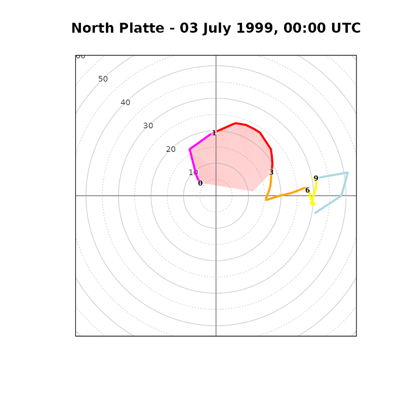
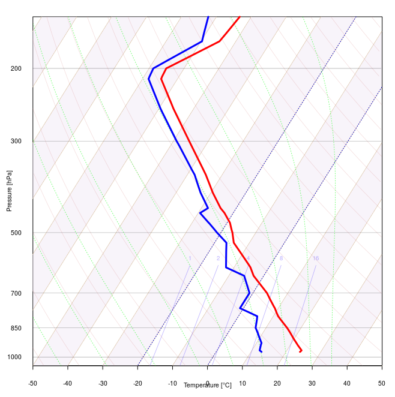
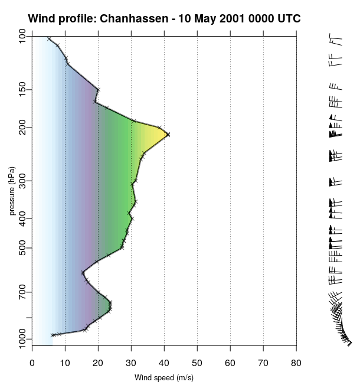

# thundeR  

**Rapid computation and visualisation of convective parameters from rawinsonde and NWP data**

<!-- badges: start --> 
[](https://github.com/bczernecki/thunder/actions)
[](https://app.codecov.io/gh/bczernecki/thunder?branch=master)
[](https://cran.r-project.org/package=thunder)
[](https://cran.r-project.org/package=thunder)
[](https://cran.r-project.org/package=thunder)
<!-- badges: end -->


**`thundeR`** is a freeware R package and collection of functions for rapid computation and visualisation of convective parameters commonly used in the operational forecasting of severe convective storms. Core algorithm is based on C++ code implemented into R language via `Rcpp`. This solution allows to compute over 100 thermodynamic and kinematic parameters in less than 0.02s per profile and process large datasets such as reanalyses or operational NWP models in a reasonable amount of time. Package has been developed since 2017 by research meteorologists specializing in severe convective storms and is constantly updated with new features.


### Online browser

Online rawinsonde browser of **thundeR** package is available at www.rawinsonde.com 


### Installation

The stable version can be installed from the CRAN repository:

``` r
install.packages("thunder")
```


The development version can be installed directly from the github repository:

``` r
remotes::install_github("bczernecki/thunder")
```

### Usage

#### Draw Skew-T, hodograph and convective parameters on a single layout and export to png file

``` r
data("sounding_vienna") # load example dataset (Vienna rawinsonde profile for 23 Aug 2011 12UTC):
pressure = sounding_vienna$pressure # vector of pressure [hPa]
altitude = sounding_vienna$altitude # vector of altitude [meters]
temp = sounding_vienna$temp  # vector of temperature [degree Celsius]
dpt = sounding_vienna$dpt # vector of dew point temperature [degree Celsius]
wd = sounding_vienna$wd # vector of wind direction [azimuth in degrees]
ws = sounding_vienna$ws # vector of wind speed [knots]
sounding_save(filename = "Vienna.png", title = "Vienna - 23 August 2011 1200 UTC", pressure, altitude, temp, dpt, wd, ws)
```


#### Download North Platte rawinsonde profile for 03 Jul 1999 00UTC and export to png file  

``` r
profile = get_sounding(wmo_id = 72562, yy = 1999, mm = 7, dd = 3,hh = 0)
sounding_save(filename = "NorthPlatte.png", title = "North Platte - 03 July 1999 0000 UTC", profile$pressure, profile$altitude, profile$temp, profile$dpt, profile$wd, profile$ws)
```


#### Compute convective parameters based on a sample vertical profile data:

``` r
library("thunder")

pressure = c(1000, 855, 700, 500, 300, 100, 10) # pressure [hPa]
altitude = c(0, 1500, 2500, 6000, 8500, 12000, 25000) # altitude [meters]
temp = c(25, 10, 0, -15, -30, -50, -92) # temperature [degree Celsius]
dpt = c(20, 5, -5, -30, -55, -80, -99) # dew point temperature [degree Celsius]
wd = c(0, 90, 135, 180, 270, 350, 0) # wind direction [azimuth in degress]
ws = c(5, 10, 20, 30, 40, 5, 0) # wind speed [knots]
accuracy = 2 # accuracy of computations where 3 = high (slow), 2 = medium (recommended), 1 = low (fast)
options(digits = 2) # change output formatting precision 
sounding_compute(pressure, altitude, temp, dpt, wd, ws, accuracy)


#             MU_CAPE        MU_03km_CAPE         MU_HGL_CAPE              MU_CIN 
#             2195.41              575.59             1568.01                0.00 
#          MU_LCL_HGT          MU_LFC_HGT           MU_EL_HGT               MU_LI 
#              730.00              730.00             8200.00               -9.63 
#             MU_WMAX          MU_EL_TEMP         MU_LCL_TEMP         MU_LFC_TEMP 
#               66.26              -28.20               17.70               17.70 
#             MU_MIXR             SB_CAPE        SB_03km_CAPE         SB_HGL_CAPE 
#               14.88             2195.41              575.59             1568.01 
#              SB_CIN          SB_LCL_HGT          SB_LFC_HGT           SB_EL_HGT 
#                0.00              730.00              730.00             8200.00 
#               SB_LI             SB_WMAX          SB_EL_TEMP         SB_LCL_TEMP 
#               -9.63               66.26              -28.20               17.70 
#         SB_LFC_TEMP             SB_MIXR             ML_CAPE        ML_03km_CAPE 
#               17.70               14.88             1559.41              416.88 
#         ML_HGL_CAPE              ML_CIN          ML_LCL_HGT          ML_LFC_HGT 
#             1187.96                0.00              975.00              975.00 
#           ML_EL_HGT               ML_LI             ML_WMAX          ML_EL_TEMP 
#             7800.00               -7.15               55.85              -25.80 
#         ML_LCL_TEMP         ML_LFC_TEMP             ML_MIXR             LR_01km 
#               15.25               15.25               13.02              -10.00 
#             LR_03km             LR_24km             LR_36km        LR_500700hPa 
#               -9.05               -5.77               -4.29               -4.29 
#        LR_500800hPa            FRZG_HGT    FRZG_wetbulb_HGT HGT_max_thetae_03km 
#               -6.67             2500.00             2300.00                0.00 
# HGT_min_thetae_04km        Delta_thetae               DCAPE  Cold_Pool_Strength 
#             3700.00               28.46              595.13               12.77 
#        Wind_Index            PRCP_WATER  Moisture_Flux_02km             RH_02km 
#               34.12               27.10               28.49                0.72 
#             RH_25km              RH_HGL             BS_01km             BS_02km 
#                0.58                0.46                3.83                8.78 
#             BS_03km             BS_06km             BS_08km             BS_36km 
#               12.66               18.01               17.41                9.37 
#             BS_18km           BS_EFF_MU           BS_EFF_SB           BS_EFF_ML 
#               20.28               14.14               14.14               13.82 
#       BS_SFC_to_HGL    BS_MU_LFC_to_HGL    BS_SB_LFC_to_HGL    BS_ML_LFC_to_HGL 
#               15.51               14.07               14.07               13.69 
#             MW_01km             MW_02km             MW_06km             MW_13km 
#                2.36                2.81                5.14                6.88 
#         SRH_100m_RM         SRH_500m_RM          SRH_1km_RM          SRH_3km_RM 
#                2.87               14.37               29.47              136.42 
#         SRH_100m_LM         SRH_500m_LM          SRH_1km_LM          SRH_3km_LM 
#                0.30                1.51                3.10              -30.53 
#             K_Index     Showalter_Index   TotalTotals_Index         SWEAT_Index 
#               24.35                3.90               44.35              106.42 
#                 STP             STP_new                 SCP             SCP_new 
#                0.26                0.14                5.39                4.23 
#                SHIP                 DCP        MU_WMAXSHEAR        SB_WMAXSHEAR 
#                0.61                0.73             1193.11             1193.11 
#        ML_WMAXSHEAR    MU_EFF_WMAXSHEAR    SB_EFF_WMAXSHEAR    ML_EFF_WMAXSHEAR 
#             1005.54              936.94              936.94              771.71
```

#### Hodograph example:

Download sounding and draw hodograph:

``` r 
chanhassen = get_sounding(wmo_id = 72649, yy = 2001, mm = 5, dd = 10, hh = 00)
sounding_hodograph(ws = chanhassen$ws, wd = chanhassen$wd, 
                   altitude = chanhassen$altitude,max_speed = 40)
title("Chanhasses - 10 May 2001, 00:00 UTC")
```




#### Customized Skew-T plot:

Download sounding and draw customized Skew-T plot (e.g. up to 150 hPa instead of default 100 hPa):

```r 
chanhassen = get_sounding(wmo_id = 72649, yy = 2001, mm = 5, dd = 10, hh = 00)
skewt_plot(ptop = 150, deg45 = TRUE, temp_stripes = TRUE)
skewt_lines(chanhassen$temp, chanhassen$pressure, ptop = 150, col="red", lwd = 3)
skewt_lines(chanhassen$dpt, chanhassen$pressure, ptop = 150, col="blue", lwd = 3)
```




#### Wind speed profile:

Download sounding and draw vertical wind speed profile with accompanying wind barbs:

``` r
dev.off()
chanhassen = get_sounding(wmo_id = 72649, yy = 2001, mm = 5, dd = 10, hh = 00)
par(fig = c(0.1, 0.75, 0.15, 0.9), new = TRUE, mar = c(1, 1, 1, 1), oma = c(0, 0, 0, 0))
sounding_wind(pressure = chanhassen$pressure, ws = chanhassen$ws, yaxs = TRUE)
title("Wind profile: Chanhassen - 10 May 2001 0000 UTC", outer = F)
par(fig = c(0.65, 0.95, 0.15, 0.9), new = TRUE, mar = c(1, 1, 1, 1), oma = c(0, 0, 0, 0))
sounding_barbs(chanhassen$pressure, chanhassen$ws, chanhassen$wd, chanhassen$altitude, interpolate = FALSE, barb_cex = 1)
```



#### Perform sounding computations using Python with rpy2:

It is possible to launch `thunder` under Python via rpy2 library. Below you can find the minimum reproducible example:

Make sure that pandas and rpy2 libraries are available for your Python environment. If not install required python packages:
``` bash 
pip install pandas  
pip install rpy2  
```

Launch `thunder` under Python with `rpy2`:

``` py
# load required packages
from rpy2.robjects.packages import importr
from rpy2.robjects import r,pandas2ri
import rpy2.robjects as robjects
pandas2ri.activate()

# load thunder package (make sure that it was installed in R before)
importr('thunder')

# download North Platte sounding 
profile = robjects.r['get_sounding'](wmo_id = 72562, yy = 1999, mm = 7, dd = 3,hh = 0)

# compute convective parameters
parameters = robjects.r['sounding_compute'](profile['pressure'], profile['altitude'], profile['temp'], profile['dpt'], profile['wd'], profile['ws'], accuracy = 2)


# customize output and print all computed variables, e.g. most-unstable CAPE (first element) equals 9413 J/kg

print(list(map('{:.2f}'.format, parameters)))
['9413.29', '233.35', '1713.74', '0.00', '775.00', '775.00', '15500.00', '-16.55', '137.21', '-66.63', '23.98',
'23.98', '23.36', '9413.29', '233.35', '1713.74', '0.00', '775.00', '775.00', '15500.00', '-16.55', '137.21', 
'-66.63', '23.98', '23.98', '23.36', '7805.13', '115.22', '1515.81', '-4.35', '950.00', '950.00', '15000.00', 
'-14.66', '124.94', '-68.41', '22.46', '22.46', '21.17', '-9.57', '-6.68', '-8.80', '-8.68', '-9.06', '-7.70', 
'4250.00', '3500.00', '0.00', '2866.00', '50.57', '52.93', '1381.81', '308.98', '29.00', '37.59', '87.03', '0.58', 
'0.40', '0.47', '8.85', '11.21', '13.88', '20.28', '29.33', '6.84', '21.70', '28.32', '28.32', '27.17', '17.06', 
'12.53', '12.53', '11.74', '7.09', '6.08', '7.77', '7.69', '19.89', '62.07', '110.06', '156.48', '6.25', '7.77', 
'4.26', '-42.78', '284.67', '5.65', '197.60', '14.19', '218.89', '7.77', '31.50', '-12.14', '60.40', '677.12', 
'4.67', '6.10', '29.46', '29.46', '3.86', '12.35', '2783.07', '2783.07', '2534.22', '3886.07', '3886.07', '3395.00']
```


#### Accuracy tables for `sounding_compute()` 

The interpolation algorithm used in the `sounding_compute()` function impacts accuracy of parameters such as CAPE or CIN and the performance of the script. The valid options for the `accuracy` parameter are 1, 2 or 3:

**accuracy = 1** - High performance but low accuracy. Dedicated for large dataset when output data needs to be quickly available (e.g. operational numerical weather models). This option is around 20 times faster than high accuracy (3) setting. Interpolation is peformed for 60 levels (m AGL): 

```r
c(0, 100, 200, 300, 400, 500, 600, 700, 800, 900, 1000, 1100, 1200, 1300, 1400, 1600, 1800, 2000, 2200, 2400, 2600, 2800, 3000, 3200, 3400, 3600, 3800, 4000, 4200, 4400, 4600, 4800, 5000, 5200, 5400, 5600, 5800, 6000, 6500, 7000, 7500, 8000, 8500, 9000, 9500, 10000, 10500, 11000, 11500, 12000, 12500, 13000, 13500, 14000, 15000, 16000, 17000, 18000, 19000, 20000)
```

**accuracy = 2** - Compromise between script performance and accuracy. Recommended for efficient processing of large numerical weather prediction datasets such as meteorological reanalyses for research studies. This option is around 10 times faster than high accuracy (3) setting. Interpolation is peformed for 318 levels (m AGL): 

```r
c(0, 10, 20, 30, 40, 50, 60, 70, 80, 90, 100, 110, 120, 130, 140, 150, 160, 170, 180, 190, 200, 210, 220, 230, 240, 250, 260, 270, 280, 290, 300, 310, 320, 330, 340, 350, 360, 370, 380, 390, 400, 410, 420, 430, 440, 450, 460, 470, 480, 490, 500, 510, 520, 530, 540, 550, 560, 570, 580, 590, 600, 610, 620, 630, 640, 650, 660, 670, 680, 690, 700, 710, 720, 730, 740, 750, 775, 800, 825, 850, 875, 900, 925, 950, 975, 1000, 1025, 1050, 1075, 1100, 1125, 1150, 1175, 1200, 1225, 1250, 1275, 1300, 1325, 1350, 1375, 1400, 1425, 1450, 1475, 1500, 1525, 1550, 1575, 1600, 1625, 1650, 1675, 1700, 1725, 1750, 1775, 1800, 1825, 1850, 1875, 1900, 1925, 1950, 1975, 2000, 2025, 2050, 2075, 2100, 2125, 2150, 2175, 2200, 2225, 2250, 2275, 2300, 2325, 2350, 2375, 2400, 2425, 2450, 2475, 2500, 2525, 2550, 2575, 2600, 2625, 2650, 2675, 2700, 2725, 2750, 2775, 2800, 2825, 2850, 2875, 2900, 2925, 2950, 2975, 3000, 3050, 3100, 3150, 3200, 3250, 3300, 3350, 3400, 3450, 3500, 3550, 3600, 3650, 3700, 3750, 3800, 3850, 3900, 3950, 4000, 4050, 4100, 4150, 4200, 4250, 4300, 4350, 4400, 4450, 4500, 4550, 4600, 4650, 4700, 4750, 4800, 4850, 4900, 4950, 5000, 5050, 5100, 5150, 5200, 5250, 5300, 5350, 5400, 5450, 5500, 5550, 5600, 5650, 5700, 5750, 5800, 5850, 5900, 5950, 6000, 6100, 6200, 6300, 6400, 6500, 6600, 6700, 6800, 6900, 7000, 7100, 7200, 7300, 7400, 7500, 7600, 7700, 7800, 7900, 8000, 8100, 8200, 8300, 8400, 8500, 8600, 8700, 8800, 8900, 9000, 9100, 9200, 9300, 9400, 9500, 9600, 9700, 9800, 9900, 10000, 10100, 10200, 10300, 10400, 10500, 10600, 10700, 10800, 10900, 11000, 11100, 11200, 11300, 11400, 11500, 11600, 11700, 11800, 11900, 12000, 12250, 12500, 12750, 13000, 13250, 13500, 13750, 14000, 14250, 14500, 14750, 15000, 15250, 15500, 15750, 16000, 16250, 16500, 16750, 17000, 17250, 17500, 17750, 18000, 18250, 18500, 18750, 19000, 19250, 19500, 19750, 20000)
```

**accuracy = 3**: High accuracy but low performance setting. Recommended for analysing individual profiles. Interpolation is performed with 5 m vertical resolution step up to 20 km AGL (i.e.: `0, 5, 10, ... 20000` m AGL)

### Important notes

- Remember to always input wind speed data in knots. 
- Script will always consider first height level as the surface (h = 0), therefore input height data can be as above sea level (ASL) or above ground level (AGL). 
- For efficiency purposes it is highly recommended to clip input data for a maximum of 16-18 km AGL or lower.
- Values of parameters will be different for different accuracy settings. 


### Developers

**thundeR** package has been developed by atmospheric scientists, each having an equal contribution (listed in alphabetical order):
- Bartosz Czernecki (Adam Mickiewicz University in Poznań, Poland)
- Piotr Szuster (Cracow University of Technology, Poland)
- Mateusz Taszarek (CIMMS/NSSL in Norman, Oklahoma, United States)

### Contributions

[Feel free to submit issues and enhancement requests.](https://github.com/bczernecki/thunder/issues)
