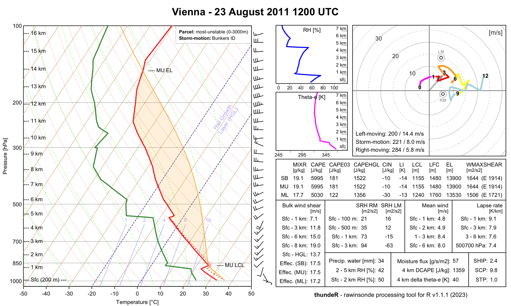

```{r, include = FALSE}
knitr::opts_chunk$set(
  collapse = TRUE,
  comment = "#>"
)
options(digits=2)
```

**`thundeR`** is a freeware R package and collection of functions for rapid computation and visualisation of convective parameters commonly used in the operational forecasting of severe convective storms. Core algorithm is based on C++ code implemented into R language via RCPP. This solution allows to compute over 100 thermodynamic and kinematic parameters in less than 0.02s per profile and process large datasets such as reanalyses or operational NWP models in a reasonable amount of time. Package has been developed since 2017 by research meteorologists specializing in severe convective storms and is constantly updated with new features.

## Online browser:

Online rawinsonde browser of `thundeR` package is available at www.rawinsonde.com 


## Main functions:

- **`sounding_compute()`** - A core function for calculating convective parameters commonly used in the operational prediction of severe convective storms. Returns a vector of parameters.
 
- **`sounding_plot()`** - Function to plot a composite of Skew-T, hodograph and selected convective parameters on a single layout
- 
- **`sounding_save()`**` - Auxiliary function to `sounding_plot` that plots a composite of Skew-T, hodograph and selected convective parameters on a single layout and exports graphical file.

- **`get_sounding()`** - Download rawinsonde measurement from sounding database of the University of Wyoming in a form convenient to use with `thundeR` package.


## Examples

Examples show aplication of selected `thundeR` package functions

#### Example 1

Draw Skew-T, hodograph and convective parameters on a single layout and export to png file:

```{r example1, eval = TRUE, fig.width=9, fig.height=6, fig.fullwidth = TRUE}
library(thunder)
data("sounding_vienna") # load example dataset (Vienna rawinsonde profile for 23 Aug 2011 12UTC):
pressure = sounding_vienna$pressure # vector of pressure [hPa]
altitude = sounding_vienna$altitude # vector of altitude [meters]
temp = sounding_vienna$temp  # vector of temperature [degree Celsius]
dpt = sounding_vienna$dpt # vector of dew point temperature [degree Celsius]
wd = sounding_vienna$wd # vector of wind direction [azimuth in degrees]
ws = sounding_vienna$ws # vector of wind speed [knots]
sounding_save(filename = "Vienna.png", title = "Vienna - 23 August 2011 1200 UTC", pressure, altitude, temp, dpt, wd, ws)
```



### Example 2

Download North Platte rawinsonde profile for 03 Jul 1999 00UTC and export to png file: 

```{r example2, eval = TRUE}
profile = get_sounding(wmo_id = 72562, yy = 1999, mm = 7, dd = 3,hh = 0)
sounding_save(filename = "NorthPlatte.png", title = "North Platte - 03 July 1999 0000 UTC", profile$pressure, profile$altitude, profile$temp, profile$dpt, profile$wd, profile$ws)
```


### Example 3

Compute convective parameters based on a sample vertical profile data:

```{r example3, eval = TRUE, fig.width=8, fig.height=8, fig.fullwidth = TRUE}
library("thunder")

pressure = c(1000, 855, 700, 500, 300, 100, 10) # pressure [hPa]
altitude = c(0, 1500, 2500, 6000, 8500, 12000, 25000) # altitude [meters]
temp = c(25, 10, 0, -15, -30, -50, -92) # temperature [degree Celsius]
dpt = c(20, 5, -5, -30, -55, -80, -99) # dew point temperature [degree Celsius]
wd = c(0, 90, 135, 180, 270, 350, 0) # wind direction [azimuth in degress]
ws = c(5, 10, 20, 30, 40, 5, 0) # wind speed [knots]
accuracy = 2 # accuracy of computations where 3 = high (slow), 2 = medium (recommended), 1 = low (fast)
options(digits = 2) # change output formatting precision 
sounding_compute(pressure, altitude, temp, dpt, wd, ws, accuracy)


#             MU_CAPE        MU_03km_CAPE         MU_HGL_CAPE              MU_CIN 
#             2195.41              575.59             1568.01                0.00 
#          MU_LCL_HGT          MU_LFC_HGT           MU_EL_HGT               MU_LI 
#              730.00              730.00             8200.00               -9.63 
#             MU_WMAX          MU_EL_TEMP         MU_LCL_TEMP         MU_LFC_TEMP 
#               66.26              -28.20               17.70               17.70 
#             MU_MIXR             SB_CAPE        SB_03km_CAPE         SB_HGL_CAPE 
#               14.88             2195.41              575.59             1568.01 
#              SB_CIN          SB_LCL_HGT          SB_LFC_HGT           SB_EL_HGT 
#                0.00              730.00              730.00             8200.00 
#               SB_LI             SB_WMAX          SB_EL_TEMP         SB_LCL_TEMP 
#               -9.63               66.26              -28.20               17.70 
#         SB_LFC_TEMP             SB_MIXR             ML_CAPE        ML_03km_CAPE 
#               17.70               14.88             1559.41              416.88 
#         ML_HGL_CAPE              ML_CIN          ML_LCL_HGT          ML_LFC_HGT 
#             1187.96                0.00              975.00              975.00 
#           ML_EL_HGT               ML_LI             ML_WMAX          ML_EL_TEMP 
#             7800.00               -7.15               55.85              -25.80 
#         ML_LCL_TEMP         ML_LFC_TEMP             ML_MIXR             LR_01km 
#               15.25               15.25               13.02              -10.00 
#             LR_03km             LR_24km             LR_36km        LR_500700hPa 
#               -9.05               -5.77               -4.29               -4.29 
#        LR_500800hPa            FRZG_HGT    FRZG_wetbulb_HGT HGT_max_thetae_03km 
#               -6.67             2500.00             2300.00                0.00 
# HGT_min_thetae_04km        Delta_thetae               DCAPE  Cold_Pool_Strength 
#             3700.00               28.46              595.13               12.77 
#        Wind_Index            PRCP_WATER  Moisture_Flux_02km             RH_02km 
#               34.12               27.10               28.49                0.72 
#             RH_25km              RH_HGL             BS_01km             BS_02km 
#                0.58                0.46                3.83                8.78 
#             BS_03km             BS_06km             BS_08km             BS_36km 
#               12.66               18.01               17.41                9.37 
#             BS_18km           BS_EFF_MU           BS_EFF_SB           BS_EFF_ML 
#               20.28               14.14               14.14               13.82 
#       BS_SFC_to_HGL    BS_MU_LFC_to_HGL    BS_SB_LFC_to_HGL    BS_ML_LFC_to_HGL 
#               15.51               14.07               14.07               13.69 
#             MW_01km             MW_02km             MW_06km             MW_13km 
#                2.36                2.81                5.14                6.88 
#         SRH_100m_RM         SRH_500m_RM          SRH_1km_RM          SRH_3km_RM 
#                2.87               14.37               29.47              136.42 
#         SRH_100m_LM         SRH_500m_LM          SRH_1km_LM          SRH_3km_LM 
#                0.30                1.51                3.10              -30.53 
#             K_Index     Showalter_Index   TotalTotals_Index         SWEAT_Index 
#               24.35                3.90               44.35              106.42 
#                 STP             STP_new                 SCP             SCP_new 
#                0.26                0.14                5.39                4.23 
#                SHIP                 DCP        MU_WMAXSHEAR        SB_WMAXSHEAR 
#                0.61                0.73             1193.11             1193.11 
#        ML_WMAXSHEAR    MU_EFF_WMAXSHEAR    SB_EFF_WMAXSHEAR    ML_EFF_WMAXSHEAR 
#             1005.54              936.94              936.94              771.71
```

### Example 4

Download sounding and draw hodograph:

```{r example4, eval = TRUE, fig.width=6, fig.height=6, fig.fullwidth = TRUE}
chanhassen = get_sounding(wmo_id = 72649, yy = 2001, mm = 5, dd = 10, hh = 00)
sounding_hodograph(ws = chanhassen$ws, wd = chanhassen$wd, 
                   altitude = chanhassen$altitude,max_speed = 40)
title("Chanhasses - 10 May 2001, 00:00 UTC")
```

### Example 5

Download sounding and draw customized Skew-T plot (e.g. up to 150 hPa instead of default 100 hPa):

```{r example5, eval = TRUE, fig.width=7, fig.height=8, fig.fullwidth = TRUE}
chanhassen = get_sounding(wmo_id = 72649, yy = 2001, mm = 5, dd = 10, hh = 00)
skewt_plot(ptop=150)
skewt_lines(chanhassen$temp, chanhassen$pressure, ptop = 150, col="red")
skewt_lines(chanhassen$dpt, chanhassen$pressure, ptop = 150, col="blue")
```

### Example 6

Wind speed vertical profile with wind barbs:

```{r example6, eval = TRUE, fig.width=8, fig.height=6, fig.fullwidth = TRUE}
chanhassen = get_sounding(wmo_id = 72649, yy = 2001, mm = 5, dd = 10, hh = 00)
par(fig = c(0.1, 0.75, 0.15, 0.9), new = TRUE, mar = c(1, 1, 1, 1), oma = c(0, 0, 0, 0))
sounding_wind(pressure = chanhassen$pressure, ws = chanhassen$ws, yaxs = TRUE)
title("Wind profile: Chanhassen - 10 May 2001 0000 UTC", outer = F)
par(fig = c(0.65, 0.95, 0.15, 0.9), new = TRUE, mar = c(1, 1, 1, 1), oma = c(0, 0, 0, 0))
sounding_barbs(chanhassen$pressure, chanhassen$ws, chanhassen$wd, chanhassen$altitude, interpolate = FALSE, barb_cex = 1)
```


## Details:

### 1. Parameters:

Below is the full list of parameters computed and exported with the `sounding_compute()` function:

**Parcel parameters:**

[1] MU_CAPE – convective available potential energy, derived from the most-unstable parcel (highest theta-e between surface and 3 km AGL). Units are J/kg.

[2] MU_03km_CAPE – convective available potential energy between surface and 3 km AGL, derived from the most-unstable parcel (highest theta-e between surface and 3 km AGL). Units are J/kg.

[3] MU_HGL_CAPE – convective available potential energy in a hail growth layer (between 0°C and −20°C), derived from the most-unstable parcel (highest theta-e between surface and 3 km AGL). Units are J/kg.

[4] MU_CIN – convective inhibition, derived from the most-unstable parcel (highest theta-e between surface and 3 km AGL). Units are J/kg.
 	
[5] MU_LCL_HGT – height of the lifted condensation level, derived from the most-unstable parcel (highest theta-e between surface and 3 km AGL). Units are m AGL. 

[6] MU_LFC_HGT – height of the level of free convection, derived from the most-unstable parcel (highest theta-e between surface and 3 km AGL). Units are m AGL. 

[7] MU_EL_HGT – height of the equilibrium level, derived from the most-unstable parcel (highest theta-e between surface and 3 km AGL). Units are m AGL. 

[8] MU_LI – lifted index, derived from the most-unstable parcel (highest theta-e between surface and 3 km AGL). Units are K.
 
[9] MU_WMAX – the maximum updraft speed in a thunderstorm (a square root of two times CAPE), derived from the most-unstable parcel (highest theta-e between surface and 3 km AGL). Units are m/s. 
	
[10] MU_EL_TEMP – temperature of the equilibrium level, derived from the most-unstable parcel (highest theta-e between surface and 3 km AGL). Units are °C. 

[11] MU_LCL_TEMP – temperature of the lifted condensation level, derived from the most-unstable parcel (highest theta-e between surface and 3 km AGL). Units are °C.  

[12] MU_LFC_TEMP – temperature of the level of free convection, derived from the most-unstable parcel (highest theta-e between surface and 3 km AGL). Units are °C. 

[13] MU_MIXR – mixing ratio at the height of the most-unstable parcel (highest theta-e between surface and 3 km AGL). Units are g/kg.
 
[14] SB_CAPE – convective available potential energy, derived from the surface-based parcel. Units are J/kg.

[15] SB_03km_CAPE – convective available potential energy between surface and 3 km AGL, derived from the surface-based parcel. Units are J/kg.

[16] SB_HGL_CAPE – convective available potential energy in a hail growth layer (between 0°C and −20°C), derived from the surface-based parcel. Units are J/kg.

[17] SB_CIN – convective inhibition, derived from the surface-based parcel. Units are J/kg.
 	
[18] SB_LCL_HGT – height of the lifted condensation level, derived from the surface-based parcel. Units are m AGL. 

[19] SB_LFC_HGT – height of the level of free convection, derived from the surface-based parcel. Units are m AGL. 

[20] SB_EL_HGT – height of the equilibrium level, derived from the surface-based parcel. Units are m AGL. 

[21] SB_LI – lifted index, derived from the surface-based parcel. Units are K.
 
[22] SB_WMAX – the maximum updraft speed in a thunderstorm (a square root of two times CAPE), derived from the surface-based parcel. Units are m/s. 
	
[23] SB_EL_TEMP – temperature of the equilibrium level, derived from the surface-based parcel. Units are °C. 

[24] SB_LCL_TEMP – temperature of the lifted condensation level, derived from the surface-based parcel. Units are °C.  

[25] SB_LFC_TEMP – temperature of the level of free convection, derived from the surface-based parcel. Units are °C. 

[26] SB_MIXR – mixing ratio at the height of the surface-based parcel. Units are g/kg.

[27] ML_CAPE – convective available potential energy, derived from the mixed-layer parcel (theta and mixing ratio averaged over 0–500m AGL layer and initialized from surface). Units are J/kg.

[28] ML_03km_CAPE – convective available potential energy between surface and 3 km AGL, derived from the mixed-layer parcel (theta and mixing ratio averaged over 0–500m AGL layer and initialized from surface). Units are J/kg.

[29] ML_HGL_CAPE – convective available potential energy in a hail growth layer (between 0°C and −20°C), derived from the mixed-layer parcel (theta and mixing ratio averaged over 0–500m AGL layer and initialized from surface). Units are J/kg.

[30] ML_CIN – convective inhibition, derived from the mixed-layer parcel (theta and mixing ratio averaged over 0–500m AGL layer and initialized from surface). Units are J/kg.
 	
[31] ML_LCL_HGT – height of the lifted condensation level, derived from the mixed-layer parcel (theta and mixing ratio averaged over 0–500m AGL layer and initialized from surface). Units are m AGL. 

[32] ML_LFC_HGT – height of the level of free convection, derived from the mixed-layer parcel (theta and mixing ratio averaged over 0–500m AGL layer and initialized from surface). Units are m AGL. 

[33] ML_EL_HGT – height of the equilibrium level, derived from the mixed-layer parcel (theta and mixing ratio averaged over 0–500m AGL layer and initialized from surface). Units are m AGL. 

[34] ML_LI – lifted index, derived from the mixed-layer parcel (theta and mixing ratio averaged over 0–500m AGL layer and initialized from surface). Units are K.
 
[35] ML_WMAX – the maximum updraft speed in a thunderstorm (a square root of two times CAPE), derived from the mixed-layer parcel (theta and mixing ratio averaged over 0–500m AGL layer and initialized from surface). Units are m/s. 
	
[36] ML_EL_TEMP – temperature of the equilibrium level, derived from the mixed-layer parcel (theta and mixing ratio averaged over 0–500m AGL layer and initialized from surface). Units are °C. 

[37] ML_LCL_TEMP – temperature of the lifted condensation level, derived from the mixed-layer parcel (theta and mixing ratio averaged over 0–500m AGL layer and initialized from surface). Units are °C.  

[38] ML_LFC_TEMP – temperature of the level of free convection, derived from the mixed-layer parcel (theta and mixing ratio averaged over 0–500m AGL layer and initialized from surface). Units are °C. 

[39] ML_MIXR – mixing ratio at the height of the surface-based parcel. Units are g/kg.

**Temperature and moisture parameters:**

[40] LR_01km – temperature lapse rate between surface and 1 km AGL. Units are K/km.

[41] LR_03km – temperature lapse rate between surface and 3 km AGL. Units are K/km.

[42] LR_24km – temperature lapse rate between 2 and 4 km AGL. Units are K/km.

[43] LR_36km – temperature lapse rate between 3 and 6 km AGL. Units are K/km.

[44] LR_500700hPa – temperature lapse rate between 500 and 700 hPa (if below ground level, the lowest available level is considered). Units are K/km.

[45] LR_500800hPa – temperature lapse rate between 500 and 800 hPa (if below ground level, the lowest available level is considered). Units are K/km.

[46] FRZG_HGT – height of freezing level (0°C) as a first available level counting from the surface. Units are m AGL.

[47] FRZG_wetbulb_HGT – height of wet-bulb freezing level (0°C) as a first available level counting from the surface. Units are m AGL.

[48] HGT_max_thetae_03km – height of the most-unstable parcel (highest theta-e between surface and 3 km AGL). Units are m AGL.
 	
[49] HGT_min_thetae_04km – height of the lowest theta-e between surface and 4 km AGL. Units are m AGL.

[50] Delta_thetae – difference in theta-e between the mean in 3–5 km AGL layer and surface. Units are K.

[51] Delta_thetae_HGL – difference in theta-e between mean in a hail growth layer (between 0°C and −20°C) and surface. Units are K.

[52] DCAPE – downdraft convective available potential energy, initialized from 4 km AGL with a mean theta-e in 3–5 km AGL layer. Units are J/kg.

[53] Cold_Pool_Strength – difference between surface temperature and temperature of the downdraft (derived from DCAPE) at the surface. Units are K.

[54] Wind_Index – based on original formula from McCann (1994), doi:  10.1175/1520-0434(1994)009<0532:WNIFFM>2.0.CO;2. Units indicate estimated wind gust potential in knots. 

[55] PRCP_WATER – precipitable water (entire column). Units are mm.

[56] Moisture_Flux_02km – mean wind speed multiplied by mean mixing ratio in the layer between surface and 2 km AGL. Units are g/s/m2.
 
[57] RH_02km – mean relative humidity between surface and 2 km AGL layer. Units are %.

[58] RH_25km – mean relative humidity between 2 and 5 km AGL layer. Units are %.

[59] RH_HGL – mean relative humidity in a hail growth layer (between 0°C and −20°C). Units are %.

**Kinematic parameters:**

[60] BS_01km – bulk wind shear between surface and 1 km AGL. Units are m/s.

[61] BS_02km – bulk wind shear between surface and 2 km AGL. Units are m/s.

[62] BS_03km – bulk wind shear between surface and 3 km AGL. Units are m/s.

[63] BS_06km – bulk wind shear between surface and 6 km AGL. Units are m/s.

[64] BS_08km – bulk wind shear between surface and 8 km AGL. Units are m/s.

[65] BS_36km – bulk wind shear between 3 and 6 km AGL. Units are m/s. 	

[66] BS_18km – bulk wind shear between 1 and 8 km AGL. Units are m/s. 	

[67] BS_EFF_MU – effective shear based on most-unstable parcel (highest theta-e between surface and 3 km AGL). See Thompson et al. (2007), doi: 10.1175/WAF969.1 for further details. Units are m/s. 	

[68] BS_EFF_SB – effective shear based on surface-based parcel. See Thompson et al. (2007), doi: 10.1175/WAF969.1 for further details. Units are m/s. 	 	

[69] BS_EFF_ML – effective shear based on mixed-layer parcel (theta and mixing ratio averaged over 0–500m AGL layer and initialized from surface). See Thompson et al. (2007), doi: 10.1175/WAF969.1 for further details. Units are m/s. 		

[70] BS_SFC_to_HGL – bulk wind shear between surface and −10°C. Units are m/s.  	

[71] BS_MU_LFC_to_HGL – bulk wind shear between most-unstable level of free convection and −10°C. Units are m/s.    	

[72] BS_SB_LFC_to_HGL – bulk wind shear between surface-based level of free convection and −10°C. Units are m/s.    	 	

[73] BS_ML_LFC_to_HGL – bulk wind shear between mixed-layer level of free convection and −10°C. Units are m/s.    	 

[74] MW_01km – mean wind speed between surface and 1 km AGL layer. Units are m/s. 

[75] MW_02km – mean wind speed between surface and 2 km AGL layer. Units are m/s. 

[76] MW_06km – mean wind speed between surface and 6 km AGL layer. Units are m/s.  

[77] MW_13km – mean wind speed between 1 and 3 km AGL layer. Units are m/s.  

[78] SRH_100m_RM – storm-relative helicity between surface and 100m AGL for right-moving supercell vector. See Bunkers et al. (2002), doi: 10.1175/1520-0434(2000)015<0061:PSMUAN>2.0.CO;2 for further details. Units are m2/s2.  

[79] SRH_500m_RM – storm-relative helicity between surface and 500m AGL for right-moving supercell vector. See Bunkers et al. (2002), doi: 10.1175/1520-0434(2000)015<0061:PSMUAN>2.0.CO;2 for further details. Units are m2/s2.   

[80] SRH_1km_RM – storm-relative helicity between surface and 1 km AGL for right-moving supercell vector. See Bunkers et al. (2002), doi: 10.1175/1520-0434(2000)015<0061:PSMUAN>2.0.CO;2 for further details. Units are m2/s2.   	

[81] SRH_3km_RM – storm-relative helicity between surface and 3 km AGL for right-moving supercell vector. See Bunkers et al. (2002), doi: 10.1175/1520-0434(2000)015<0061:PSMUAN>2.0.CO;2 for further details. Units are m2/s2.   	

[82] SRH_100m_LM – storm-relative helicity between surface and 100m AGL for left-moving supercell vector. See Bunkers et al. (2002), doi: 10.1175/1520-0434(2000)015<0061:PSMUAN>2.0.CO;2 for further details. Units are m2/s2.   

[83] SRH_500m_LM – storm-relative helicity between surface and 500m AGL for left-moving supercell vector. See Bunkers et al. (2002), doi: 10.1175/1520-0434(2000)015<0061:PSMUAN>2.0.CO;2 for further details. Units are m2/s2.    

[84] SRH_1km_LM – storm-relative helicity between surface and 1 km AGL for left-moving supercell vector. See Bunkers et al. (2002), doi: 10.1175/1520-0434(2000)015<0061:PSMUAN>2.0.CO;2 for further details. Units are m2/s2.    	

[85] SRH_3km_LM – storm-relative helicity between surface and 3 km AGL for left-moving supercell vector. See Bunkers et al. (2002), doi: 10.1175/1520-0434(2000)015<0061:PSMUAN>2.0.CO;2 for further details. Units are m2/s2.    	

[86] Bunkers_RM_A – azimuth for right-moving supercell vector. See Bunkers et al. (2002), doi: 10.1175/1520-0434(2000)015<0061:PSMUAN>2.0.CO;2 for further details. Units are °.   

[87] Bunkers_RM_M – wind speed for right-moving supercell vector. See Bunkers et al. (2002), doi: 10.1175/1520-0434(2000)015<0061:PSMUAN>2.0.CO;2 for further details. Units are m/s. 

[88] Bunkers_LM_A  – azimuth for left-moving supercell vector. See Bunkers et al. (2002), doi: 10.1175/1520-0434(2000)015<0061:PSMUAN>2.0.CO;2 for further details. Units are °.	

[89] Bunkers_LM_M – wind speed for left-moving supercell vector. See Bunkers et al. (2002), doi: 10.1175/1520-0434(2000)015<0061:PSMUAN>2.0.CO;2 for further details. Units are m/s.  	

[90] Bunkers_MW_A  – azimuth for mean storm motion vector. See Bunkers et al. (2002), doi: 10.1175/1520-0434(2000)015<0061:PSMUAN>2.0.CO;2 for further details. Units are °.	

[91] Bunkers_MW_M – wind speed for mean storm motion vector. See Bunkers et al. (2002), doi: 10.1175/1520-0434(2000)015<0061:PSMUAN>2.0.CO;2 for further details. Units are m/s.  	

**Composite parameters:**

[92] K_Index 	– based on original formula from George (1960): "Weather Forecasting for Aeronautics" Academic Press, London, 1960, p. 673. Units are K.

[93] Showalter_Index – based on original formula from Showalter (1953), doi: 10.1175/1520-0477-34.6.250. Units are K.  

[94] TotalTotals_Index – based on original formula from Miller (1972): "Notes on analysis and severe-storm forecasting procedures of the Air Force Global Weather Central", AWS Tech. Rpt. 200(rev), Air Weather Service, Scott AFB, IL. Units are K.

[95] SWEAT_Index – based on original formula from Bidner (1970): "The Air Force Global Weather Central severe weather threat (SWEAT) index—A preliminary report". Air Weather Service Aerospace Sciences Review, AWS RP 105-2, No. 70-3, 2-5. Parameter is dimensionless.
	
[96] STP – based on the fixed layer formula currently used on the Storm Prediction Center mesoanalysis (https://www.spc.noaa.gov/exper/mesoanalysis/) as of 1 March 2021. Parameter is dimensionless. 	

[97] STP_new – based on original formula from Coffer et al. (2019), doi: 10.1175/WAF-D-19-0115.1. Parameter is dimensionless.	

[98] SCP – based on Thompson et al. (2007), "An update to the supercell composite and significant tornado parameters". Preprints, 22nd Conf. on Severe Local Storms, Hyannis, MA, Amer. Meteor. Soc. P (Vol. 8), but with effective SRH replaced with surface to 3 km AGL SRH and effective bulk wind shear replaced with surface to 6 km AGL bulk wind shear. Parameter is dimensionless.  	

[99] SCP_new – based on formula from Gropp and Davenport (2018), doi: 10.1175/WAF-D-17-0150.1, but with effective SRH replaced with surface to 3 km AGL SRH. Parameter is dimensionless.	 	

[100] SHIP – based on formula currently used on the Storm Prediction Center mesoanalysis (https://www.spc.noaa.gov/exper/mesoanalysis/) as of 1 March 2021. Parameter is dimensionless.  	

[101] DCP – based on formula currently used on the Storm Prediction Center mesoanalysis (https://www.spc.noaa.gov/exper/mesoanalysis/) as of 1 March 2021. Parameter is dimensionless.   	

[102] MU_WMAXSHEAR – most-unstable WMAX multiplied by surface to 6 km AGL bulk wind shear. See Taszarek et al. (2020), doi: 10.1175/JCLI-D-20-0346.1 for further details. Units are m2/s2. 	 	

[103] SB_WMAXSHEAR – surface-based WMAX multiplied by surface to 6 km AGL bulk wind shear. See Taszarek et al. (2020), doi: 10.1175/JCLI-D-20-0346.1 for further details. Units are m2/s2. 	 		

[104] ML_WMAXSHEAR – mixed-layer WMAX multiplied by surface to 6 km AGL bulk wind shear. See Taszarek et al. (2020), doi: 10.1175/JCLI-D-20-0346.1 for further details. Units are m2/s2. 	 	 	

[105] MU_EFF_WMAXSHEAR – most-unstable WMAX multiplied by most-unstable effective bulk wind shear. See Taszarek et al. (2020), doi: 10.1175/JCLI-D-20-0346.1 for further details. Units are m2/s2. 	 	 	

[106] SB_EFF_WMAXSHEAR – surface-based WMAX multiplied by surface-based effective bulk wind shear. See Taszarek et al. (2020), doi: 10.1175/JCLI-D-20-0346.1 for further details. Units are m2/s2. 	 	  	

[107] ML_EFF_WMAXSHEAR – mixed-layer WMAX multiplied by mixed-layer effective bulk wind shear. See Taszarek et al. (2020), doi: 10.1175/JCLI-D-20-0346.1 for further details. Units are m2/s2. 	 	  	

### 2. Accuracy tables for `sounding_compute()` 

The interpolation algorithm used in the `sounding_compute()` function impacts accuracy of parameters such as CAPE or CIN and the performance of the script. The valid options for the `accuracy` parameter are 1, 2 or 3:

`accuracy = 1` - High performance but low accuracy. Dedicated for large dataset when output data needs to be quickly available (e.g. operational numerical weather models). This option is around 20 times faster than high accuracy (3) setting. Interpolation is peformed for 60 levels (m AGL): 

```{r accuracy1, echo = FALSE}
c(0, 100, 200, 300, 400, 500, 600, 700, 800, 900, 1000, 1100, 1200, 1300, 1400, 1600, 1800, 2000, 2200, 2400, 2600, 2800, 3000, 3200, 3400, 3600, 3800, 4000, 4200, 4400, 4600, 4800, 5000, 5200, 5400, 5600, 5800, 6000, 6500, 7000, 7500, 8000, 8500, 9000, 9500, 10000, 10500, 11000, 11500, 12000, 12500, 13000, 13500, 14000, 15000, 16000, 17000, 18000, 19000, 20000)
```

`accuracy = 2` - Compromise between script performance and accuracy. Recommended for efficient processing of large numerical weather prediction datasets such as meteorological reanalyses for research studies. This option is around 10 times faster than high accuracy (3) setting. Interpolation is peformed for 318 levels (m AGL): 

```{r accuracy2, echo = FALSE}
c(0, 10, 20, 30, 40, 50, 60, 70, 80, 90, 100, 110, 120, 130, 140, 150, 160, 170, 180, 190, 200, 210, 220, 230, 240, 250, 260, 270, 280, 290, 300, 310, 320, 330, 340, 350, 360, 370, 380, 390, 400, 410, 420, 430, 440, 450, 460, 470, 480, 490, 500, 510, 520, 530, 540, 550, 560, 570, 580, 590, 600, 610, 620, 630, 640, 650, 660, 670, 680, 690, 700, 710, 720, 730, 740, 750, 775, 800, 825, 850, 875, 900, 925, 950, 975, 1000, 1025, 1050, 1075, 1100, 1125, 1150, 1175, 1200, 1225, 1250, 1275, 1300, 1325, 1350, 1375, 1400, 1425, 1450, 1475, 1500, 1525, 1550, 1575, 1600, 1625, 1650, 1675, 1700, 1725, 1750, 1775, 1800, 1825, 1850, 1875, 1900, 1925, 1950, 1975, 2000, 2025, 2050, 2075, 2100, 2125, 2150, 2175, 2200, 2225, 2250, 2275, 2300, 2325, 2350, 2375, 2400, 2425, 2450, 2475, 2500, 2525, 2550, 2575, 2600, 2625, 2650, 2675, 2700, 2725, 2750, 2775, 2800, 2825, 2850, 2875, 2900, 2925, 2950, 2975, 3000, 3050, 3100, 3150, 3200, 3250, 3300, 3350, 3400, 3450, 3500, 3550, 3600, 3650, 3700, 3750, 3800, 3850, 3900, 3950, 4000, 4050, 4100, 4150, 4200, 4250, 4300, 4350, 4400, 4450, 4500, 4550, 4600, 4650, 4700, 4750, 4800, 4850, 4900, 4950, 5000, 5050, 5100, 5150, 5200, 5250, 5300, 5350, 5400, 5450, 5500, 5550, 5600, 5650, 5700, 5750, 5800, 5850, 5900, 5950, 6000, 6100, 6200, 6300, 6400, 6500, 6600, 6700, 6800, 6900, 7000, 7100, 7200, 7300, 7400, 7500, 7600, 7700, 7800, 7900, 8000, 8100, 8200, 8300, 8400, 8500, 8600, 8700, 8800, 8900, 9000, 9100, 9200, 9300, 9400, 9500, 9600, 9700, 9800, 9900, 10000, 10100, 10200, 10300, 10400, 10500, 10600, 10700, 10800, 10900, 11000, 11100, 11200, 11300, 11400, 11500, 11600, 11700, 11800, 11900, 12000, 12250, 12500, 12750, 13000, 13250, 13500, 13750, 14000, 14250, 14500, 14750, 15000, 15250, 15500, 15750, 16000, 16250, 16500, 16750, 17000, 17250, 17500, 17750, 18000, 18250, 18500, 18750, 19000, 19250, 19500, 19750, 20000)
```

`accuracy = 3`: High accuracy but low performance setting. Recommended for analysing individual profiles. Interpolation is performed with 5 m vertical resolution step up to 20 km AGL (i.e.: `0, 5, 10, ... 20000` m AGL)

### Performance comparison:

```{r performace, echo=TRUE}
library(thunder)
data("sounding_vienna")
t1 = system.time(sounding_compute(sounding_vienna$pressure, sounding_vienna$altitude, sounding_vienna$temp, sounding_vienna$dpt, sounding_vienna$wd, sounding_vienna$ws, accuracy = 1))
t2 = system.time(sounding_compute(sounding_vienna$pressure, sounding_vienna$altitude, sounding_vienna$temp, sounding_vienna$dpt, sounding_vienna$wd, sounding_vienna$ws, accuracy = 2))
t3 = system.time(sounding_compute(sounding_vienna$pressure, sounding_vienna$altitude, sounding_vienna$temp, sounding_vienna$dpt, sounding_vienna$wd, sounding_vienna$ws, accuracy = 3))
print(t1)
print(t2)
print(t3)
```

### Important notes

- Remember to always input wind speed data in knots. 
- Script will always consider first height level as the surface (h = 0), therefore input height data can be as above sea level (ASL) or above ground level (AGL). 
- For efficiency purposes it is highly recommended to input data for a maximum of 16-18 km AGL or lower.
- Values of parameters will be different for different accuracy settings. 
